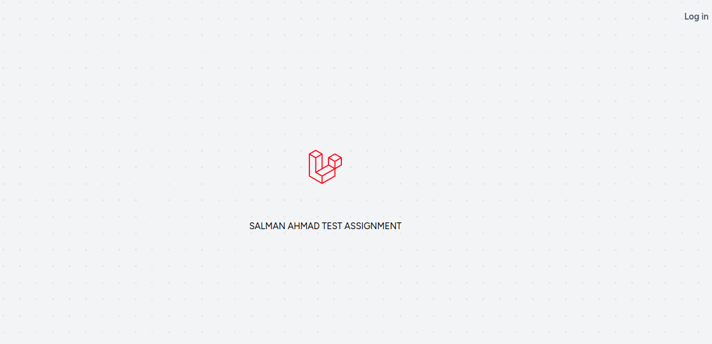
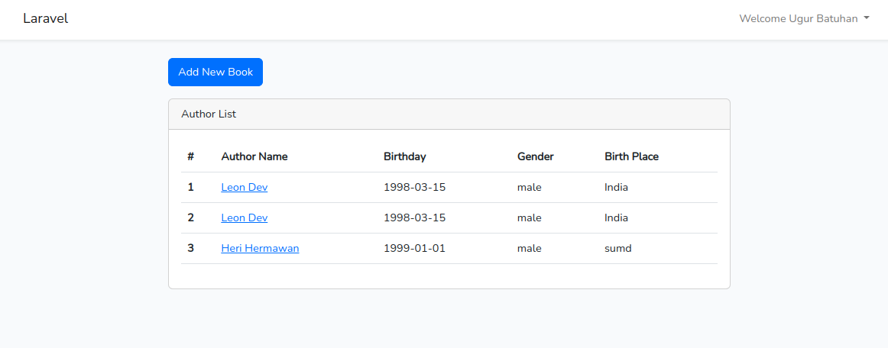
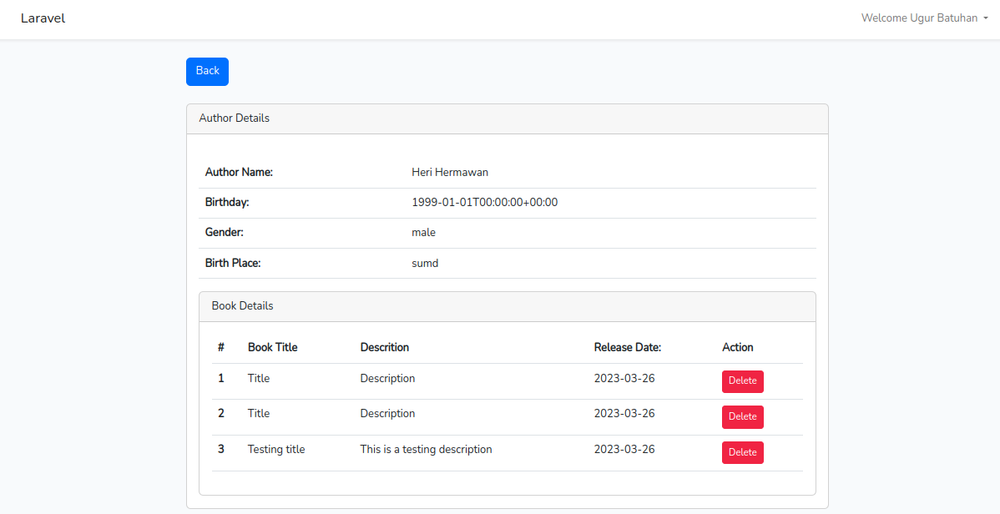

# Laravel Assignment Test Project
To setup the project you need to follow these simple steps-

## Requirement

Minimum PHP 8.1 or greater version required

## Running Project

To run this project at your local system you need to clone or download the the project at your local system and now find and rename ".env.example" file to ".env"


## Now navigate to your project folder and run the following command

```bash
    composer install
```

Once the installation has been completed then run below command and keep it running-

```bash
    npm install && npm run dev
```

Now open another command window and now run the below command-

```bash
    php artisan serve
```
It will complite your project and give you a url of your project. Now, Go to your web browser, type the given URL and view the app output: http://localhost:8000/

## Screenshots

**1.** 

**2.** 

**3.** 
